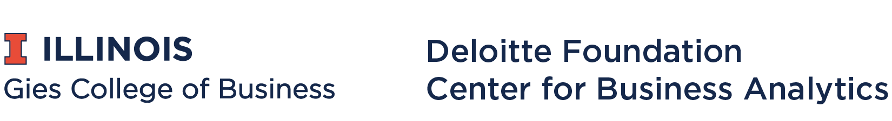

  

# Data Carpentry for Business:  Python

The [Data Carpentry for Business](https://github.com/data-lessons/python-business) workshop series is developed and overseen by [Prof. Robert J. Brunner](https://business.illinois.edu/profile/robert-brunner/).  It is funded by Deloitte Foundation Center for Business Analytics at Gies College of Business, University of Illinois at Urbana, Champaign.  

## Background

Python for Business is a software skills training programme aimed at business students. It helps business students learn about basics of programming and how to perform Excel-like tasks with python. It builds on the work of [Data Carpentry](http://www.datacarpentry.org/). It used [python novice inflammation](https://github.com/swcarpentry/python-novice-inflammation) and [python for Ecology](https://github.com/datacarpentry/python-ecology-lesson/) as basis.

See also [the corresponding SQL lesson](https://github.com/data-lessons/sql-business).

## Code of Conduct

All participants should agree to abide by the [Software Carpentry Code of Conduct](http://software-carpentry.org/conduct/).

## Contributors

- Robert Brunner (PI)

- [Linden Lu](https://github.com/zllu2)
- [Hao Xi](https://github.com/TacNayn) (initial author)

Maintained by [Neal Davis](https://www.github.com/davis68).

## Citation

Please cite as:

Data Carpentry. Python Lesson for Business.  April 2018.  https://github.com/data-lessons/python-business.
