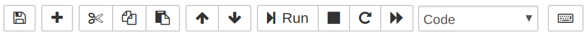
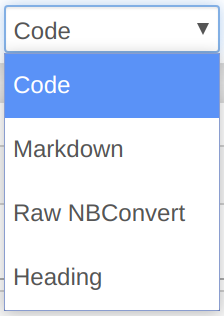
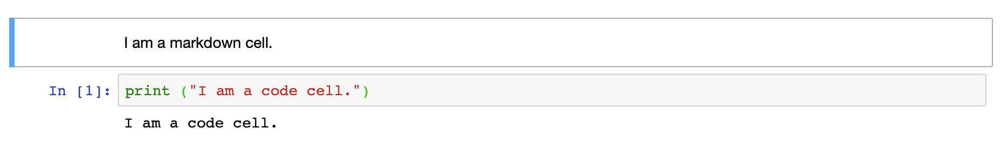

## What is a Jupyter Notebook?

When one runs any program on a computer or a smartphone, one has to interact using an _interface_.  Most of the time, this just means the app menu (a table of icons), the Windows Start menu, or the like.  When one writes one's own code, however, the choice of how to execute that code is much broader.  We will use a _notebook_, which acts like a web page which lets you write and run code from within your browser.

When you run a Jupyter notebook, what you see is a web page with text, images, equations, videos, and executable code.  There are a few working parts that you need to get familiar with to use the notebook effectively, though.

<div class="alert alert-success">
The Jupyter team has provided a helpful <a href="http://jupyter-notebook.readthedocs.io/en/latest/examples/Notebook/Notebook%20Basics.html">introduction to working with notebooks</a>, including how to use the menu commands, toolbar, and keyboard shortcuts.
</div>


##  Getting Started

Depending on your machine, you may have several ways to access the Jupyter notebook server.  We assume that you have already [downloaded and installed Anaconda Python](https://www.anaconda.com/products/individual), which includes Jupyter notebook already.

1. Open the [Anaconda Navigator](https://docs.anaconda.com/anaconda/navigator/) by searching for it at the Start Menu or by double-clicking it on your Desktop.

    

2. Open the Jupyter Notebook option (not JupyterLab, which is a related tool).  _After a moment, your browser should open with the Jupyter dashboard._

<div class="alert alert-warning">
If you do not have Anaconda Python installed, on macOS or Linux you should be able to access the Terminal and execute <code>jupyter notebook</code> to get started.  If you use this approach, be sure to keep the Terminal open the entire time you are working on the notebook.
</div>


## The Dashboard

When your browser opens to the Jupyter dashboard, you will see a listing of files and folders, presumably (but not always) your home directory.  The dashboard serves as a home page for Jupyter.  The tabs located across the tyop indicate the modes of access you have, and typically include `Files`, `Running`, and `Clusters`.  From `Files` you are able to access notebooks located in folders throughout your home folder.  From `Running` you can check on the status of active notebooks.


### Your First Notebook

We would like to start working on a new notebook, and for simplicity we will start one in a new folder.

1. Click the `New` button at top right.
2. Select the `Folder` option.
3. Name the folder `workshop` and confirm.

    _A new folder named `workshop` appears._

4. Click into the new folder, where we will create a new notebook.
5. Click the `New` button at top right.
6. Select the `Python 3` notebook option.

    _A new notebook starts in the current folder.  A new browser tab opens and shows you a clean-slate notebook._

The new notebook has a menu bar across the top and a toolbar for common actions.  The main thing that interests us is the cell, the gray bar which you can click in and type.

There are several kinds of cells, but the default cell is a _code cell_.

7. Click in the cell so that you see a cursor blinking.
8. Type `1+1` and press `Ctrl`+`Enter`.

    _The code you typed evaluates, produces the output `2`, and Jupyter inserts a new code cell below._

Your basic working pattern when using a notebook will be to enter code into a gray code cell, then execute the code using `Ctrl`+`Enter` (or the `Run` button on the toolbar).  You may then click back into the cell, edit the code, and run it again as necessary.

At this point, you can use the code cells like a calculator.  Try some of the following inputs in separate code cells:

-   `5 * 5`
-   `5 ** 2`  (what does this do?)
-   `25 ** 0.5`  (what does this do?)

You can also write longer blocks of code in a cell.  Copy and paste the following into a single cell and evaluate it:

```
from math import sin,pi
sin(pi/4)
```

The Python computing language, which we'll talk about in detail later, acts a lot like a graphing calculator for basic mathematical calculations.

Let's circle back around and talk a bit more about the Jupyter interface before diving into Python.  Save your notebook using the `File` menu in Jupyter and then close the browser tab.


### Jupyter Tabs

On the main Jupyter page, `Files` tab, you should see a new `Untitled.ipynb` notebook, which is the one you just created.  If you select it, you can `Rename` it to a more helpful name, such as `My First Notebook`.

{:height="500px"}

Click over to the `Running` tab.  You should see the notebook you just created listed there, because it's still running even though you closed the tab.  You can select it and stop it from running, or you can click it and it will open up again where you left it.  (As a general rule, you should close and halt a notebook when you are done with it, else it eats up computer memory and processing power later on.)

{:height="330px"}


### Your First Notebook, Revisited

Click back into your first notebook using any of the means we've seen before.  A new browser tab should open again and you can see your content.

Let's talk about what the various options on the toolbar represent.



You can save (and should do so frequently).

`+` adds a new cell.

You can cut, copy, and paste entire cells, or move them around.

You can run a cell, or stop it if it is taking too long to run.

The `Code` drop-down is interesting.  Click into it.



The body of a notebook is composed of cells.  Each cell can contain different kinds of data, such as code input, code output, or Markdown (descriptive text).  Cells can be included in any order and edited at-will, allowing for a large amount of flexibility for telling the story of your data analysis.

- **Markdown cells** are used to display text.  Copy and paste the following into a cell, set its type to `Markdown`, and `Ctrl`+`Enter` to evaluate it.

    ```
    Steps in data analysis include:
    1. Data entry or ingest
    2. Data cleaning
    3. Data integrity check
    4. Data analysis
    5. Data visualization

    [This is a link.](https://www.audubon.org/field-guide/bird/belted-kingfisher)

    
    ```

    [Markdown][df] is a particularly way of writing text consistently so that it can be turned into a well-formatted document later.

- **Code cells** specify your calculations, whether entry, analysis, or reporting.  The *input cells* are where you, the user, type the code to be executed, while the *output cells* display what results from executed code.

{:height="150px"}

<div class="alert alert-warning">
One thing to be careful about, though:  if you start typing when a cell isn't in the editing mode, Jupyter may interpret your keystrokes as command shortcuts.  Surprising things—like deleting cells or undoing intentional changes—may occur as a result.
</div>

{:height="70px"}

> ## Markdown Exercise
>
> Since you will document your work using Markdown cells in notebooks, it behooves us to work a bit more with them directly.
>
> Consider this Markdown cell:
>
> ~~~
> The lifecycle of a business includes the following stages:
> - seed funding and development
> - startup
> - growth and establishment
> - expansion
> - maturity and possible exit
>
> [The small business lifecycle](https://cdn.business2community.com/wp-content/uploads/2014/03/Small-Business-Lifecycle5.jpg)
>
> ~~~
> {: .language-markdown}
>
> Take a moment and alter this input so that the list is numbered and the image is displayed in-place rather than linked.  You can check the [Markdown rules][df] if you need to, or ask your instructor or helpers.
>
> > ## Solution
> ~~~
> The lifecycle of a business includes the following stages:
> 1. seed funding and development
> 2. startup
> 3. growth and establishment
> 4. expansion
> 5. maturity and possible exit
>
> 
>
> ~~~
> {: .language-markdown}
> {: .solution}
{: .challenge}

As a best practice, we recommend that you use Markdown to document everything you need to understand your work:  explanations, images, documentation, equations, everything.

Code cells are for your process, the actual realization of your intent.  Markdown cells are for your documentation, the explanation of every stage of your process.  Done properly, a notebook becomes its own report.

Finally, to return to the dashboard, you can select the browser tab which contains it.  If you have closed the browser tab, you may access the dashboard from within a notebook by clicking the Jupyter icon at top left.
