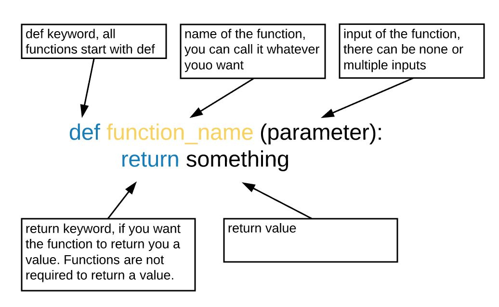

## Function 
What if we want to use some code again,
on a different dataset or at a different point in our program?
Cutting and pasting it is going to make our code get very long and very repetitive,
very quickly. 
We'd like a way to package our code so that it is easier to reuse,
and Python provides for this by letting us define things called 'functions' ---
a shorthand way of re-executing longer pieces of code.

A function is reusable code that performs a certain action. 

{:height="300px"}

The function definition opens with the keyword `def` followed by the
name of the function and a parenthesized list of parameter names. The
[body]({{ page.root }}/reference/#function-body) of the function --- the
statements that are executed when it runs --- is indented below the
definition line.

Foe example, in the exercise, you wrote some code to reverse a string. If you want to use it on other strings, you don't have to copy and paste the code. All you have to do is to add a few lines to make it a function: 
~~~
def rev(oldstring):
    newstring = ''
    for char in oldstring:
        newstring = char + newstring
    print(newstring)
    return newstring
~~~
{: .language-python}

When we call the function,
the values we pass to it are assigned to those variables
so that we can use them inside the function.
Inside the function,
we use a [return statement]({{ page.root }}/reference/#return-statement) to send a result back to whoever asked for it.
Now you can use it on whatever strings you want like this: 
~~~
rev("string")
~~~
{: .language-python}

This command should call our function, using "string" as the input and return the function value.

> ## Challenge 2.1
> Write a function that returns the average of the list <br>
> Hint: use built in functions `sum()` to get the sum and `len()` to get the lenth  
> ~~~
> # you can test your code with the following:  
> lt = [1,2,3,4,5,7]
> your_function_name(lt)  
> it should return 3.66667
> ~~~
> {: .language-python}
>
> > ## Solution
> > ~~~
> > def avg(lt):
> >     return sum(lt)/len(lt)
> > ~~~
> > {: .language-python}
> {: .solution}
{: .challenge}

## Modules   

A [module](https://docs.python.org/3/tutorial/modules.html) is a file containing Python definitions and statements. A module can contain executable statements as well as function definitions, you can include a module with `import` statement. 
For example, Python does not provide a built in function for square root. Of course, you can write a function that do square root by yourself. But the good thing is, the function is included in the built in `math` module. You can import the `math` module by:  
```
import math
math.sqrt(7)
```
Too see what we can do with the module, we can read its [documentation](https://docs.python.org/3/library/math.html). Modules usually have clearly stated documentations that tells you what functions are included and how to use them. To use the functions, you do `module_name.function_name()`. 

A cool thing about Python is that there are a lot of modules avaliable for you to perform various kinds of tasks. For example, there are modules that do statistics, graphing, charts, etc. Many useful functions are pre written, and you just have to find the modules and import them. 
Note that not all modules are included in your Python package in the beginning. Sometimes you have to download the module before importing it. For example, there is a cool graphing module is called `plotly`, and if you simply do `import plotly`, it will fail because the file is not in your computer yet. You can download it by using the `!pip install` statement: 

```
!pip install plotly
```
After that, you will be able to import the module.  

> ## Challenge 2.2
> Write a function that returns the standard deviation of the list <br>
> Hint: you have just wrote a function that returns the average, you can use it here  
> Hint 2: power of two can be achieved by using `** 2`
> ~~~
> # you can test your code with the following:  
> lt = [1,2,3,4,5,7]
> your_function_name(lt)  
> it should return 1.9720265943665387  
> ~~~
> {: .language-python}
>
> > ## Solution
> > ~~~
> > def std(lt):
> >     average = avg(lt)
> >     sum_squared_dev = 0
> >     for num in lt: 
> >         sum_squared_dev = sum_squared_dev + (num - average) ** 2
> >     return math.sqrt(temp/len(lt))
> > ~~~
> > {: .language-python}
> {: .solution}
{: .challenge}

An alternative is that you can import the [`scipy`](https://docs.scipy.org/doc/numpy/reference/generated/numpy.std.html) module, and the standard deviation function is pre written for you. 
```
import scipy
scipy.std(lt)
```
So much easier.  
As business students, you don't really have to actually implement functions such as standard deviation, PCA (demention reduction) and some problistic models at detailed level because they are usually pre written in some modules. Of course, it will never hurt if you are interested in learning them so that you can write your customized function to better fit your tasks (path way to an engineer). However, for most of us, it is more helpful to learn what kind of analysis we need for a certain task, what modules can perform the analysis, and how to use the functions in the modules. To find modules, you can first google your task, and go to the module's website to read the documentations. 

## Readable functions

Consider this function:

~~~
def s(p):
    a = avg(p)
    t = 0
    for q in p: 
        t = t + (q - a) ** 2
    return math.sqrt(t/len(p))
~~~
{: .language-python}

The functions `s` actually calculates standard deviation, exactlly the same as the previous exercise. 
But to a human reader, it is difficult to read.  

As this example illustrates, both documentation and a programmer's
_coding style_ combine to determine how easy it is for others to read
and understand the programmer's code. Choosing meaningful variable
names and using blank spaces to break the code into logical "chunks"
are helpful techniques for producing _readable code_. This is useful
not only for sharing code with others, but also for the original
programmer. If you need to revisit code that you wrote months ago and
haven't thought about since then, you will appreciate the value of
readable code!

> ## Challenge 2.3
>
> Write a function `rescale` that takes an array as input
> and returns a corresponding array of values scaled to lie in the range 0.0 to 1.0.
> (Hint: If `L` and `H` are the lowest and highest values in the original array,
> then the replacement for a value `v` should be `(v-L) / (H-L)`.)
>
> > ## Solution
> > ~~~
> > def rescale(input_array):
> >     L = numpy.min(input_array)
> >     H = numpy.max(input_array)
> >     output_array = (input_array - L) / (H - L)
> >     return output_array
> > ~~~
> > {: .language-python}
> {: .solution}
{: .challenge}

> ## Challenge 2.4
>
> Rewrite the `rescale` function so that it scales data to lie between `0.0` and `1.0` by default,
> but will allow the caller to specify lower and upper bounds if they want.
> Compare your implementation to your neighbor's:
> do the two functions always behave the same way?
>
> > ## Solution
> > ~~~
> > def rescale(input_array, low_val=0.0, high_val=1.0):
> >     '''rescales input array values to lie between low_val and high_val'''
> >     L = numpy.min(input_array)
> >     H = numpy.max(input_array)
> >     intermed_array = (input_array - L) / (H - L)
> >     output_array = intermed_array * (high_val - low_val) + low_val
> >     return output_array
> > ~~~
> > {: .language-python}
> {: .solution}
{: .challenge}

> ## Challenge 2.5
>
> What does the following piece of code display when run --- and why?
>
> ~~~
> f = 0
> k = 0
>
> def f2k(f):
>   k = ((f-32)*(5.0/9.0)) + 273.15
>   return k
>
> f2k(8)
> f2k(41)
> f2k(32)
>
> print(k)
> ~~~
> {: .language-python}
>
> > ## Solution
> >
> > ~~~
> > 259.81666666666666
> > 287.15
> > 273.15
> > 0
> > ~~~
> > {: .output}
> > `k` is 0 because the `k` inside the function `f2k` doesn't know about the `k` defined outside the function.
> {: .solution}
{: .challenge}

> ## Readable Code
>
> Revise a function you wrote for one of the previous exercises to try to make
> the code more readable. Then, collaborate with one of your neighbors
> to critique each other's functions and discuss how your function implementations
> could be further improved to make them more readable.
{: .challenge}
