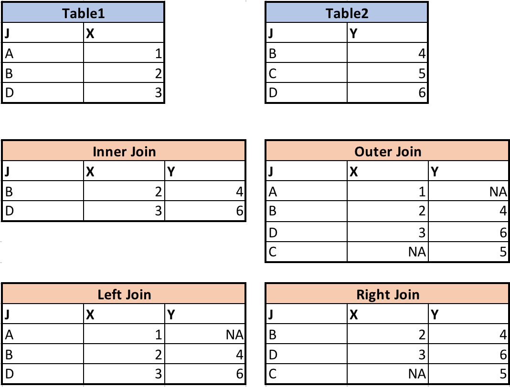
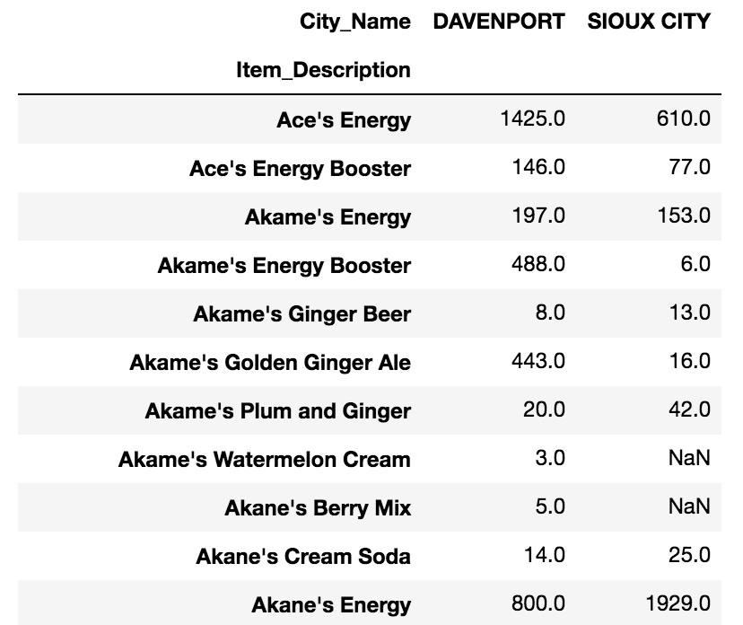

## Working with Tabular Data

When we read information from a table, we use a casual $x--y$ system to do so:  we typically find the record we want (reading down the rows) and then locate the column which contains the value we need to look up.  This cleanly separates the two kinds of factors we need to think about:  the set of records, and the set of values they contain.


Spreadsheets are valuable because they contain tabular data and allow us to add new fields and relationships.  We prefer spreadsheets to be well-organized with only one kind of table in each sheet, and very consistent layout.  This makes our tabular data easy for humans to read and (more importantly now) easy for computers to process automatically.


One of the chief limitations of working with spreadsheets, however, is that they are limited in the number of columns and rows they can manipulate.  (At the time of writing, Excel can load 1,048,576 rows and 16,384 columns.  This may seem like a lot, but consider common applications like processing transaction records or stock events.)  Python is only limited by your computer's memory in processing data sets.

Another limitation of working with spreadsheets is the automation available.  While you can compose macros in Excel, it is often cumbersome to generalize your program away from specific cells, and anyone you share with needs to have the ability to run the same macros.  Automatic data manipulation in Python can be shared freely with others and can scale to any new data coming in.  It can also help you think very carefully and precisely about the data in terms of the fields (like "Tax Rate" or "Country") rather than Excel column/row notation (like "A4" and "$B$13").

Finally, by judiciously using backups of your code, you can trace changes in the development of your analysis procedures.  Should you need to work backwards to a previous version, you can easily have that available in a superseded Python file, while spreadsheets don't store an undo history older than the current session.


## The Soft Drink Dataset

We will utilize a dataset representing soft drink sales at a number of convenience stores.  Transactions and product data are included.

> Please download the [dataset](../data/data_code.zip) for this workshop.  You should unzip it to your current working directory.  If you are having trouble identifying this, please ask a helper.
>
> We will two files from this dataset in subsequent Python lessons, `item.csv` and `invoice.csv`.
{: .callout}

This dataset contains records with the following fields:

`invoice.csv`:

| Field               | Data Type | Description                                                |
|---------------------|:----------|------------------------------------------------------------|
| County_id           | `int`     | Unique id for each county                                  |
| County_Name         | `str`     | Name of county                                             |
| City_Name           | `str`     | Name of the city that the county is in                     |
| Vendor_id           | `int`     | Unique id for each vendor                                  |
| Vendor_Name         | `str`     | Name of the vendor                                         |
| Store_id            | `int`     | Unique id for each store                                   |
| Store_Name          | `str`     | Name of the store                                          |
| Address             | `str`     | Address of the store                                       |
| Zip_Code            | `int`     | Zip code of the store                                      |
| Invoice_id          | `str`     | Unique id for each invoice                                 |
| Date                | `str`     | Date of the invoice                                        |
| Bottle_Sold         | `int`     | Number of bottle sold in the invoice                       |
| Item_id             | `int`     | Unique id for each item (soda)                             |

`item.csv`:

| Field               | Data Type | Description                                                |
|---------------------|:----------|------------------------------------------------------------|
| Item_id             | `int`     | Unique id for each item (soda)                             |
| Category            | `str`     | Category of soda                                           |
| Item_Description    | `str`     | Name of the item (soda)                                    |
| Pack                | `int`     | Number of bottles that the soda usually sells for          |
| Bottle_Volume_ml    | `float`   | Volumn of the soda in ml                                   |
| Bottle_Cost         | `float`   | Cost of one bottle                                         |
| Bottle_Retail_Price | `float`   | Retile price for one bottle                                |

These files have the suffix `csv`.  Typically, you are used to seeing `xls` and `xlsx`, which are Excel's preferred formats.  `csv` files are "comma-separated value" files.  Run the following command to see what is inside of one of these files—it will show you the first ten lines of data in their raw unprocessed format.

    !head -n 10 soda.csv

You can see the tabular structure of the file, and we will take advantage of this to load it into Python using a kind of table called a DataFrame.

The file `invoice.csv`, incidentally, has about 930,000 records in it, which is under but extremely close to the limit imposed by Excel.  If you double-click it to open it in Excel, it will likely take up to 30 seconds to process, and analysis would be similarly mired in difficulties.


## Pandas

The [Python Data Analysis Library](http://pandas.pydata.org/) (a.k.a. Pandas) provides tools and data structures for working with tabular data.  You will furthermore use it to produce plots, and you can integrate it with other Python libraries for your analysis.

You have seen already that libraries extend Python's functionality.  We will load Pandas and—since the name is a bit cumbersome to type again and again—we will rename it to `pd`.

```python
import pandas as pd
```

As before, whenever we use a Pandas-derived function, we need to preface the function with `pd.`.

### Reading Tabular Data from `csv` Files

Our first step is to pull in the data from the file `item.csv`, which contains product data for the soft drinks.

```python
pd.read_csv("item.csv")
```

Jupyter recognizes the result of this as a table and displays a well-formatted grid.  However, we haven't stored the result of this function anywhere.  Let's name it `soda`:

```python
soda = pd.read_csv("item.csv")
```

Go ahead and load the invoice data now as well.

```python
inv = pd.read_csv("invoice.csv")
```

Use Python to check the type of one of these:

```python
type(soda)
```

We call this a [`DataFrame`](http://pandas.pydata.org/pandas-docs/stable/dsintro.html#dataframe).  You can think of it as a "viewless" spreadsheet—that is, you can access it and manipulate it without needing to see the entire thing laid out.

> ### So What _Is_ a DataFrame?
>
> A `DataFrame` is a 2-dimensional data structure that can store data of different types (including characters, integers, floating point values, factors and more) in columns.
{: .callout}

### Exploring the Dataset

Run

```python
soda
```

to see the table.  It is quite large, and a bit complicated to wrap our heads around.  We can see the approximate ranges of values for each field as we scan up and down the records, but displaying the entire table at once is cumbersome.  Instead, we can use

```python
soda.head()   
```

to show us only the first few rows of data.  Often this is enough to get an idea of the data set.

What kind of data do `soda` and `inv` contain?  `DataFrame`s have a built-in function `info()` which can answers this question:

> ~~~
> soda.info()
> ~~~
> {: .language-python}

We see how many entries there are for each field and the kind of data stored in each field.  The data types don't quite look familiar based on what we've seen before.  What should each correspond to in our regular Python types?

> ## Accessing Data Inside a DataFrame
>
> Using our DataFrame `soda`, try out the attributes & methods below to see
> what they return.
>
> 1. `soda.columns`
> 2. `soda.shape`
> 3. `soda.tail()`
{: .challenge}

### Selecting Data

One of the most common operations in a spreadsheet is to select data.  Pandas makes it straightforward to select rows, columns, and internal subsets of data as necessary.

**Column**.  Tradtionally, spreadsheets denote columns by letters.  If you want to refer to the field itself, you have to include a column header, and if you are writing a formula, you have to be very careful to use the right column letter.

Using Pandas, the field name (column name, same thing) is a string.  Use it as an "index" into the DataFrame to select the entire column:

```python
inv['Store_id']
```

This returns a `Series`, which is Pandas' representation of a single column.  It's a bit simpler than a `DataFrame`, and mainly notable for requiring an extra step to process sometimes.

To select multiple columns, use a list of columns names as the index.

```python
inv[["Store_id", "Store_Name"]]
```

Note that this approach returns a `DataFrame`, not a `Series`.

**Row**.  Spreadsheets number rows (records).  Typically the first field in each record (the first column in each row) is a descriptor of the data set.

Using Pandas, each row is numbered uniquely.  You can access a record using its number:

```python
soda.iloc[100]
```

To make this a bit more intuitive, use the first column as the row label rather than a numeric index.  It's much easier to think about "Cherry Soda" that it is to think about "Row 45."  To do this, we have to reload the data using a special flag called `index_col`:

```python
soda = pd.read_csv("item.csv",index_col='Item_Description')
inv = pd.read_csv("invoice.csv",index_col='Invoice_id')
```

Run `.info()` and `.head()` again with each of these to see what has changed.

Now when you want to access a row, you can use the record label:

```python
soda.loc["Saitama's Cream Soda"]
```

(Note that `.iloc[]` is used with numeric indices while `.loc[]` is used with row labels.)

**Subset**.  You can use indexing together with field names and record labels to grab particular subsets of data:

```python
TODO
```

We will use these selection abilities to produce gradually more complicated formulas for analyzing our data.  For instance, to get a list of all of the categories in the `soda` `DataFrame`, use

```python
soda['Category']
```

With this list in hand, we can use `pd.unique` to extract a list (a `Series`, really) of how many unique categories there are.

```python
pd.unique(soda['Category'])
```

Now how would you tell _how many_ unique categories there are?

As in life, there are many ways to accomplish the same end when programming.  Instead of using `pd.unique`, you can use `.drop_duplicates`:

```
soda.drop_duplicates("Category")
```

The difference here is that all other columns are still included.

One more thing:  did you notice that one of the values in `soda['Category']` isn't a string?  `nan` means "Not a Number" and is commonly used to mean that a value is missing.  The advantage of using `nan` is that missing data don't get accidentally included as zeroes, but it can mess up some calculations.  To remove them, use

```python
soda['Category'].dropna()
```

E.g.,

```python
pd.unique(soda['Category'].dropna())
```

Note that `.dropna` doesn't change the underlying data:  it returns a modified copy of the data.

### Sorting and Filtering Values in `DataFrame`s

Spreadsheets have powerful features for sorting and filtering records based on value.  What are the equivalent Python operations?

**Sorting**.  `DataFrame`s can be sorted by one or multiple columns:

```python
# sort by one column:
soda.sort_values(["Bottle_Cost"])

# sort by multiple columns:
soda.sort_values(["Bottle_Cost","Item_Description"])

# sort by multiple columns with different orders in each:
soda.sort_values(["Bottle_Cost","Item_Description"], ascending=[True,False])
```

How would you sort on bottle cost without `nan`s in the data set?

TODO exercise sort descending on something

**Filtering**.  Filtering describes selecting records based on their values (by range, for instance) or selecting records based on multiple fields.

For instance, select all soft drinks that have a `Bottle_Cost` less than $3:

```python
soda[soda["Bottle_Cost"]<= 3]["Item_Description"]

```
> ## Combining Filters
>
> If we need multiple criteria, we can put parentheses over each criteria and use `&` (and) or `|` (or) to combine the criterias. For example, let's select sodas that are at least 500ml and cheaper than $3.     
>  
> > ## Solution
> > ```python
> > soda[(soda["Bottle_Volume_ml"] >= 500) & (soda["Bottle_Cost"]<= 3)]["Item_Description"]
> > ```
> {: .solution}
{: .challenge}


# Basic Arithmetics with Pandas  
Similar as Excel, Pandas allows you to do basic arithmetics with the numbers in the DataFrame.  
For example, if you want to calculate the pack price of each soda (Pack * Bottle_Retail_Price):
```
soda['Pack'] * soda['Bottle_Retail_Price']  
```
To assign a new column in `soda` DataFrame to store this result, we can:
```
soda['Pack_Price'] = soda['Pack'] * soda['Bottle_Retail_Price']  
```
If you don't want this column, you can delete it by:  
```
soda = soda.drop(['Pack_Price'], axis = 1)
```
Very important, the `.drop()` will not change anything in the original DataFrame. Instead, it will return a new dataframe with the "Pack_Price" column removed. You have to assign the new DataFrame to the variable `soda` with `soda =`.

> ## Challenge  
>
> Create an column in the `soda` dataframe that shows the profit margin ((price-cost)/cost) of each soda.      
>  
>> ## Solution
>> ```
>> soda['Profit_Margin'] = (soda['Bottle_Retail_Price'] - soda['Bottle_Cost']) / soda['Bottle_Cost']
>> ```
> {: .solution}
{: .challenge}

# Basic Statistics with Pandas  

Excel has "descriptive statistics" function in the built in data analytics tools. We can do similar things with Pandas.
Let's perform some quick summary statistics to learn more about the data that we're working with. We can perform summary stats quickly using groups. We often want to calculate summary statistics grouped by subsets or attributes
within fields of our data. For example, we might want to calculate the average
cost of each soda.

We can calculate basic statistics for all records in a single column using the
syntax below:

```python
soda['Bottle_Cost'].describe()
```
gives **output**

```python
count    4166.000000
mean        3.648721
std         9.348512
min         1.500000
25%         2.360000
50%         2.860000
75%         3.610000
max       500.000000
Name: Bottle_Cost, dtype: float64
```

We can also extract one specific metric if we wish:

```python
soda['Bottle_Cost'].min()
soda['Bottle_Cost'].max()
# We can do many other statistic measures such as .std(), .count(), .sum() ... etc
```

## Merge database  

Sometimes we need data from many different tables.
For example, we have two tables below:  
{:height="130px"} <br>
And we want to merge them together: <br>
{:height="130px"} <br>
Many people probably know how to do this in Excel. You can just use vlookup function. (you will probably use it a lot in your future jobs)
```Excel
=VLOOKUP(A3,$E$3:$F$5,2,FALSE)  
```
We can also do this in Pandas with [`pandas.DataFrame.merge`](https://pandas.pydata.org/pandas-docs/stable/generated/pandas.DataFrame.merge.html) (you can click to see documentation).  
```python
# I only listed some frequently used parameters. You can see all parameters in the documentation.  
DataFrame.merge(Another_DataFrame, how='inner, outer, left or right', left_on="Left_Join_Column_Name", right_on="Right_Join_Column_Name")
```
"how" determines the join type. The following chart shows the difference between each kinds of joins, assume column "J" is the join column:  
{:height="400px"} <br>

Let's have a quick demonstration of the merges performed in the charts above.
```python  
# firstly, load in the tables
table1 = pd.DataFrame({'J': ['A', 'B', 'D'], 'X': [1, 2, 3]})
table2 = pd.DataFrame({'J': ['B', 'C', 'D'], 'Y': [4, 5, 6]})
```
```python
# inner join
table1.merge(table2, how="inner", right_on="J", left_on="J")
# outer join
table1.merge(table2, how="outer", right_on="J", left_on="J")
# left join
table1.merge(table2, how="left", right_on="J", left_on="J")
# right join
table1.merge(table2, how="right", right_on="J", left_on="J")
```

Let's go back to our data. We have two DataFrames, `soda` and `invoice`. In the `invoice` DataFrame, the only information about soda is the "Item_id" column. If we want to see details of the soda associated with each invoice, we need to join the two tables together. Since `soda` DataFrame also has "Item_id" column, "Item_id" column can be used as join column.   
> ## Challenge
>
> Merge `soda` and `inv` tables, call it **inv_soda**.
> Not all kinds of soda will appear in the invoice (some were never sold). If we want to keep everything in the `soda` dataframe, what kinds of join should we use?
>
>> ## Solution
>> ```
>> inv_soda = inv.merge(soda, how="left", right_on="Item_id", left_on="Item_id")  
>> ```
>>  
> {: .solution}
{: .challenge}

> ## Challenge
>
> Check how many rows are there in the joined table. Is it the same as the invoice table (930508 rows)?  
> If they are different, find the exact problem child/children that caused the difference.  
> Hint: to find which value is empty, you can do `df[df["column_name"].isnull()]`  
>
>> ## Solution
>> ```python
>> len(inv_soda)
>> ```
>> The result is 93509 rows. This is because one kind of soda was never sold.  
>> Let's find out what is it:  
>> ```
>> inv_soda[inv_soda["Invoice_id"].isnull()]  
>> ```
>> Yummy Surstromming Juice. Try it, its good.    
>>
> {: .solution}
{: .challenge}

## Aggregate Function  

But if we want to summarize by one or more variables, for example, if we want to find out how many bottles has each soda been sold.
In Excel, we will probably use pivot table. In Pandas, we can use **Pandas' `.groupby` method**. Once we've created a groupby DataFrame, we
can quickly calculate summary statistics by a group of our choice. <br>   
Note that Pandas has pivot table too, we will cover later.   

```python
# Group data by Item_Description
# The code below counts the number of invoice_id associated with each Item_Description. You can have other
grouped_df = inv_soda.groupby('Item_Description').agg({"Invoice_id":"count"})
grouped_df
```
You will get something like this:
```
                      Invoice_id
Item_Description  
Ace's Energy          262
Ace's Energy Booster  64
Akame's Energy        80
...
```
Note that "Item_Description" and "Invoice_id" are not at the same level. This is because the groupby function automatically made "Item_Description" the index. If we do `grouped_df.columns`, we will only see the `Invoice_id` column. To avoid problems when using the aggregated result, we might want to:
```python
grouped_df = inv_soda.groupby('Item_Description', as_index=False).agg({"Invoice_id":"count"})  
grouped_df  
```
The columns are at the same level now.
```
  Item_Description        Invoice_id
0 Ace's Energy            262
1 Ace's Energy Booster    64
2 Akame's Energy          80
...
```
Now if you do `grouped_df.columns`, both "Item_Description" and "Invoice_id" will show up.  

The column of count has the name of the counted column, or Invoice_id. You may change it to a more descriptive name with `rename()` function.  

```python
inv_soda.groupby('Item_Description', as_index=False).agg({'Invoice_id':'count'}).rename(columns={'Invoice_id':'Count'})
```
The output now is:
```
  Item_Description        Count
0 Ace's Energy            262
1 Ace's Energy Booster    64
2 Akame's Energy          80
...
```

Note that the input in `.agg()` is a dictionary. Because we can generate multiple aggregate columns at the same time. For example:  

```python
inv_soda.groupby('Item_Description', as_index=False).agg({"Invoice_id":"count", "Bottle_Cost":"mean"})
# think about this, what does it return?   
```

> ## Challenge
>
> Find the average `Bottle_Cost` and `Bottle_Retail_Price` for each category
>
>> ## Solution
>>
>> ```
>> inv_soda.groupby('Category', as_index=False).agg({"Bottle_Cost":"mean","Bottle_Retail_Price":"mean"})
>>
>> ```
> {: .solution}
{: .challenge}

## Pivot Table  
One of the most useful functionalities in Excel is pivot table. You can also create [pivot table](https://pandas.pydata.org/pandas-docs/stable/generated/pandas.pivot_table.html#pandas-pivot-table) with Pandas!

A basic pivot table contains the following parameters:  
```python
pandas.pivot_table(DataFrame, values, index, columns, aggfunc)
# values: columns to aggregate (just like choosing the field to report in Excel pivot table)
# index: keys to group by on the pivot table index (just like dragging into the row box in Excel pivot table)
# columns: keys to group by on the pivot table column (just like dragging into the column box in Excel pivot table)
# aggfunc: aggregate function, for example, mean, sum, min, etc. (just like setting the values box in Excel pivot table)
```
For example you want to see the total bottles sold for each soda in each city, you can:  
```
pd.pivot_table(inv_soda, values="Bottles_Sold", index = ["Item_Description"],\
            columns = ["City_Name"], aggfunc="sum")   

```
You will get something like this:  
{:height="300px"}

> ## Challenge
>
> Create a pivot table that shows the total bottle sold for from each vendor in each category. Set Vendor_Name as index and Category as columns.
>
>> ## Solution
>>
>> ```
>> pd.pivot_table(inv_soda, values="Bottles_Sold", index = ["Vendor_Name"],\
            columns = ["Category"], aggfunc="sum")
>>
>> ```
> {: .solution}
{: .challenge}
