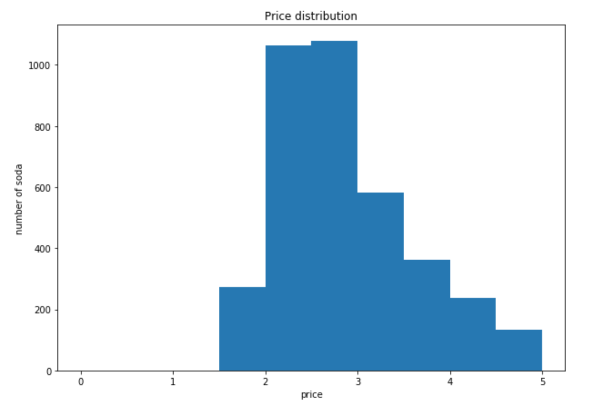
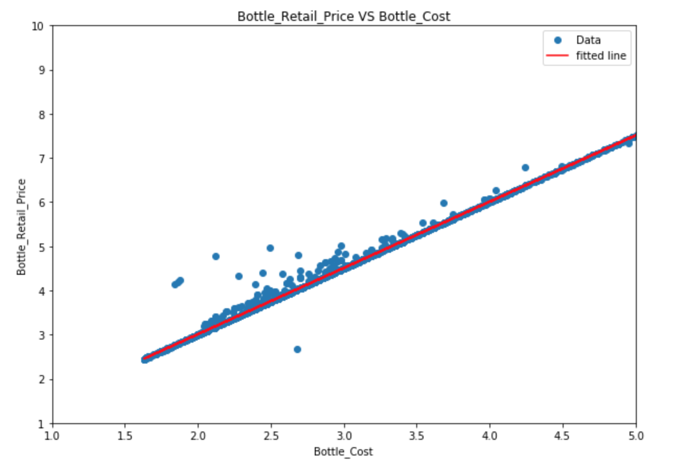

## Statistical Analysis

The cornerstone of understood data is statistical analysis.  If you want to build sound statistical analysis in a spreadsheet, you typically use either built-in tools or add-ons like the [Analysis ToolPak](https://support.office.com/en-us/article/Load-the-Analysis-ToolPak-in-Excel-6a63e598-cd6d-42e3-9317-6b40ba1a66b4) in Excel.

In Python, we will utilize the Pandas-compatible library [SciPy](https://www.scipy.org/), which contains many statistical tools for testing and exploring data sets.


### Student's t-test

The t-test is a way of examining and comparing populations.  (You may have seen this used previously in a statistics class.)  We will use the t-test to examine whether two different categories of soft drinks are significantly different in sales.  Formally, we will perform a [t-test](https://docs.scipy.org/doc/scipy/reference/generated/scipy.stats.ttest_ind.html) assuming different variance.

Import the `stats` submodule to gain access to the tools we need:

```python
from scipy import stats
```

We will utilize our `groupby`/`aggregate` functionality which we developed previously.  We want to find the total bottles sold for each soft drink in each category.

(Take a moment and construct this expression yourself.)

```python
ct = inv_soda.groupby(['Item_Description','Category'], as_index=False).agg({"Bottles_Sold":"sum"})
```

Next, get the total bottles sold for both categories.

```python
ct_eng = ct[ct["Category"] == "Energy Drink"]
ct_cola = ct[ct["Category"] == "Cola"]
```

With this information in hand, we can perform the t-test.

```python
stats.ttest_ind(ct_eng['Bottles_Sold'],ct_cola['Bottles_Sold'], equal_var=False)
```

yielding

```python
Ttest_indResult(statistic=1.9035249229837687, pvalue=0.057480903679786859)
```
{: .output}

In this case, the p value is not low enough to justify rejecting the null hypothesis.

> ## Challenge:  Test p values
>
> Construct a t-test to see whether two different markups have the same sales rate.  Use the markup ranges of less than $2 and more than or equal to $2.
>
> > ## Solution
> >
> > ```
> > ct_lt2 = ct[ct["Markup"] < 2]
> > ct_ge2 = ct[ct["Markup"] >= 2]
> >
> > stats.ttest_ind(ct_lt2['Bottles_Sold'],ct_ge2['Bottles_Sold'], equal_var=False)
> > ```
> {: .solution}
{: .challenge}


Scipy has an ample set of statistical tools, in many ways more extensive than the Excel Analysis ToolPak.  Other example operations include [chi-squares](https://docs.scipy.org/doc/scipy/reference/generated/scipy.stats.chisquare.html#scipy.stats.chisquare), [ANOVAs](https://docs.scipy.org/doc/scipy/reference/generated/scipy.stats.f_oneway.html#scipy.stats.f_oneway), and [k-stats](https://docs.scipy.org/doc/scipy/reference/generated/scipy.stats.kstat.html#scipy.stats.kstat).  There are many other modules that can perform more expansive statistics, data mining, and machine learning—for example, [scikit-learn](http://scikit-learn.org/stable/) and [`statsmodels`](https://www.statsmodels.org/stable/index.html).

Frequently the most difficult part is to process the data into an appropriate form ("preprocessing").  As soon as the data are prepared, you can feed them into the SciPy model without further ado.  Develop your programs with this utility and (relative) ease-of-use in mind.


## Visualization

### Basics

Graphing with a spreadsheets affords many conveniences:

- Data selection and updating
- Click-to-edit visual styling
- Prepackaged visual styles

Python uses code to generate plots.  This means that you lose the advantages of the graphical interface, but this is compensated by introducing repeatability, automation, and precise control over details.  We will use the [MatPlotLib](https://matplotlib.org/) library.  First, let's import it:

```python
import matplotlib.pyplot as plt
%matplotlib inline
```

The simplest way to use this is just to provide x and y data.

```python
# create three points for the first line
x = [1,2,3]
y = [2,3,5]
plt.plot(x,y)
plt.show()
```

(On newer systems, the last line may not be necessary.)

These data points assume all of the defaults of MatPlotLib, such as blue lines between points, no axis labels, and no title.  A better plot would pay attention to such niceties:

```python
# First data set:
x1 = [1,2,3]
y1 = [2,3,5]

# Second data set:
x2 = [1.5,2.5,3.5]
y2 = [2.7,3.7,5.7]

# Set figure size:
plt.figure(figsize=(10,7))

# Plot the data with labels.
plt.plot(x,y, label="first line")
plt.plot(x2,y2, label="second line")

# Set x,y limits:
plt.xlim(0, 5)
plt.ylim(0, 7)

# Add axis labels:
plt.xlabel("independent variable")
plt.ylabel("dependent variable")

# Add a title:
plt.title("example")

# Add a legend:
plt.legend()

# Show the graph:
plt.show()
```

You should get something like:

{:height="400px"}

This may seem less intuitive than using a spreadsheet.  After all, how does one know what all of the options are?  There are two ways to figure this out:

1.  Check the docs at [`pyplot.plot`](https://matplotlib.org/api/_as_gen/matplotlib.pyplot.plot.html).  This is useful for finding specific functionality but is often overwhelming.
2.  Check the [gallery](https://matplotlib.org/gallery) of interesting plots.  Each of these provides source code for the image, and you can readily find examples which are similar to what you are aiming for in your plot.


> ## Challenge:  Plotting a `DataFrame`
>
> Construct a plot which shows markup on the y axis as a function of bottle cost on the x axis.  Use dots `'.'`.  You may wish to filter out values greater than 100.  If you do so, you'll need to filter both x and y data sets to retain the same number of points.
>
> > ## Solution
> >
> > ```
> > # Set size:
> > plt.figure(figsize=(10,7))
> >
> > plt.plot(soda['Markup'],soda['Bottle_cost'])
> >
> > # Set x,y labels:
> > plt.xlabel("Bottle Cost")
> > plt.ylabel("Markup")
> >
> > # Add title:
> > plt.title("Markup as a function of bottle cost")
> > plt.legend()
> >
> > plt.show()
> > ```
> {: .solution}
{: .challenge}


### Histogram

A histogram shows the distribution of data by counting how many of them fall into particular ranges (or "bins").

Assume we want to see the price distribution of soft drinks that cost less than $5.  We will use [`pyplot.hist`](https://matplotlib.org/api/_as_gen/matplotlib.pyplot.hist.html) to produce a histogram.

```python
# Set size:
plt.figure(figsize=(10,7))

# Feed in the data, set the range and number of bins, and plot the graph:
plt.hist(soda['Bottle_Cost'], range=(0,5), bins=15)

# Set x,y labels:
plt.xlabel("Price")
plt.ylabel("Number of sodas")

# Add title:
plt.title("Price distribution")

plt.show()
```

{:height="400px"}

> ## Challenge:  Histogram
>
> Produce a histogram which shows the volume distribution of two different categories on the same plot with ten bins.  You may need to trim off an erroneous high-volume bottle, at say 3L.
>
> > ## Solution
> >
> > ```
> > # Set size:
> > plt.figure(figsize=(10,7))
> >
> > # Feed in the data, set the range and number of bins, and plot the graph:
> > plt.hist(soda['Bottle_Volume_ml'][soda['Bottle_Volume_ml']<3e3][soda['Category']=='Cream Soda'],label='Cream Soda', bins=15)
> > plt.hist(soda['Bottle_Volume_ml'][soda['Bottle_Volume_ml']<3e3][soda['Category']=='Cola'],label='Cola', bins=15)
> >
> > # Set x,y labels:
> > plt.xlabel("Bottle Volume")
> > plt.ylabel("Number of sodas")
> >
> > # Add title:
> > plt.title("Price distribution")
> > plt.legend()
> >
> > plt.show()
> > ```
> {: .solution}
{: .challenge}


### Scatter plot

A scatter plot is a two-dimensional data visualization that uses dots to represent the values obtained for two different variables.

```python
# Set figure size:
fig, ax = plt.subplots(figsize=(10,7))

# Plot data:
ax.scatter(soda['Bottle_Cost'], soda['Bottle_Retail_Price'])

# Set x,y labels:
plt.xlabel("Bottle_Cost")
plt.ylabel("Bottle_Retail_Price")

# Set title:
plt.title("Bottle_Retail_Price VS Bottle_Cost")

# Set x, y limits:
plt.xlim(1, 5)
plt.ylim(1, 10)

# Set a legend:
plt.legend()

plt.show()
```

{:height="400px"}

Any of the plots you can make in a spreadsheet program like Excel can be made with MatPlotLib.  Check the gallery, figure out how, and you can produce fantastic graphics for reports and presentations.

Some companies prefer you to use a different tool like Tableau to produce images.  In that case, Python is helpful for preparing and filtering the data to be fed into that program.

Many other Python-based visualization modules are available, including [Plotly](https://plot.ly/) and [`graph-tool`](https://graph-tool.skewed.de).  These can produce interactive graphs as well.

> ## Challenge:  Pie Chart
>
> Assume that a new convenience store has just opened.  You want to compare and see which categories of soft drinks other stores spent the most money on.
>
> What are the top three categories in terms of total cost?  Visualize these with a pie chart.  Read the [documentation](https://matplotlib.org/api/_as_gen/matplotlib.pyplot.pie.html) yourself and try to figure out how to draw it.
>
> 1.  Calculate total cost for each soft drink (arithmetic).
> 2.  Calculate total cost for each category (aggregation).
> 3.  Sort the aggregated values.
> 4.  Draw the graph.  (What are the x data?  What is the label?)
> 5.  Set `autopct` parameter to `'%.0f%%'`.
>
> > ## Solution
> >
> > ```
> > inv_soda["Total_Cost"] = inv_soda["Bottle_Cost"] * inv_soda["Bottles_Sold"]
> > ct = inv_soda.groupby(['Category'])["Total_Cost"].agg(["sum"]).reset_index()
> > ct = temp.sort_values("sum", ascending = False)
> >
> > plt.figure(figsize=(15,15))
> > plt.pie(ct["sum"], labels=ct["Category"], autopct='%.0f%%')
> > plt.show()
> > ```
> {: .solution}
{: .challenge}
