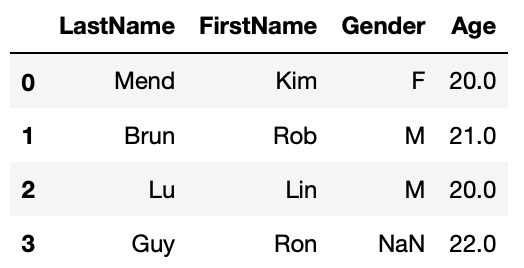
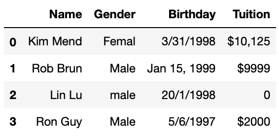
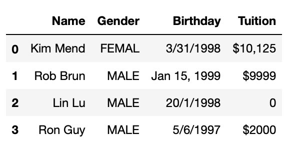
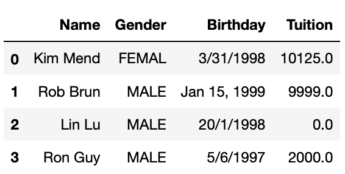
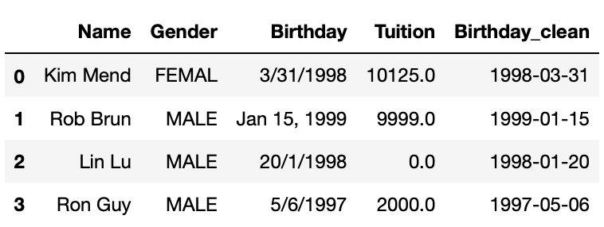

Survey of data analysts found that they spend most of their time massaging rather than mining or modeling data. Data preparation accounts for 60-80% of the work of data analysts. In this section we will introduce some common techniques in data preparation. Mastering these techniques may save you a lot time and trouble. In this lesson, we will introduce some commonly used python data preparation techniques, which include:
- Load Data
- Change Column Name
- Handle Missing Data
- Manipulate String Values
- Transform Datetime
- Lambda Function

## Load Data

A dataset can be one of several different types. Dataset type is distinguished on the basis of data storage and structure. In this lesson, we will briefly introduce how to load **structured** data from various storage type, CSV file, Excel file and relational database, using `pandas` functions. We first need to import the pandas module:  
> ~~~
>import pandas as pd
> ~~~
> {: .language-python}

#### From CSV File

Comma separated values or CSV file, is one of the most popular way to store structured data. We call `pandas` function `read_csv()` to load a dataset from CSV files to `pandas` `DataFrame`.

> ~~~
>df = pd.read_csv('filename.csv')
> ~~~
> {: .language-python}

`read_csv()` have many other arguments in addition to file name. For example, following code loads a CSV file which uses '\|' as delimiter, skips the first 5 rows in the file, sets the first column as dataframe index:

> ~~~
>df = pd.read_csv('filename.csv', delimiter='|', index_col=0, skiprows=5)
> ~~~
> {: .language-python}

To learn the detail of the function, check out the functions doc string:

> ~~~
>#display function doc string
>help(pd.read_csv)
> ~~~
> {: .language-python}

#### From Spreadsheet

To load a dataset from an Excel file, we will use `pandas` function `read_excel()`. Following code load a dataset from sheet "sheet1" of an excel file "filename.xlsx":

> ~~~
>df = pd.read_excel('filename.xlsx', sheet_name='sheet1')
> ~~~
> {: .language-python}

As `read_csv()`, `read_excel()` takes many other arguments. Please refer to the doc string of the function (`help(pd.read_excel)`) for more detail.

#### From Relational database

`pandas` function `read_sql()` can be used to load data from a relational database. We need to provide a database connection to the function, we also need to provide a query which will be used to retrieve values from the database. In following code, we assume there's a sqlite database "mydb" in current folder, and there's a table with name tblCustomer. We will load all rows from tblCustomer table to a DataFrame. The column names of tblCustomer will be the column names of the resulting DataFrame.

> ~~~
>import pandas as pd
>import sqlite3 as sql
>with sql.connect('mydb') as con:
    df_customer = pd.read_sql('select * from tblCustomer', con)
> ~~~
> {: .language-python}

Using `with` clause to create a database connection ensures that the connection will be closed after the block is executed.

## Change Column Name

When a dataset is loaded to a DataFrame. It may or may not have column names. If there's no column names, we usually need to assign meaningful column names based on data understanding. When the DataFrame does have column names, we may still need to modify them to make following work easier. Industry practice suggests column names should:
- **not** contain spaces. Instead of `Last Name` as column name, it should be `LastName` or `last_name`
- **not** contain special characters(e.g. $, &, %, -, all punctuations)
- be descriptive and provide some information in the field

DataFrame has `columns` property, you can reset all column names with:

`df.columns = [col_name1, col_name2...]`

You can also change a perticular column name with function `rename()`:

`df.rename(columns={orignial_name:new_name}, inplace=True)`

Notice that `df.rename()` will return a renamed DataFrame by default. If you want to rename `df` in place, you need to set the function argument `inplace=True`. For more details of the function, check out the doc string with `help(df.rename)`.

## Handle Missing Data

Dataset can have missing values for various reasons such as observations not recorded or data corruption. Handling missing data is very important as many analytic algorithms do not support data with missing values.

Missing data is represented as `NaN` which stands for "Not a Number" in pandas DataFrame. We will demonstrate common techniques to handling missing values in a DataFrame which include:
- Find general information about missing values in the DataFrame
- Simply drop rows with missing value
- Fill missing value
    - with constant
    - with mode(for categorical features)
    - with mean/median(for continuous features)
    - with estimated values generated from other columns

First, we will create a DataFrame with missing values.

> ~~~
>import numpy as np
>import pandas as pd
>df1 = pd.DataFrame({'LastName':['Mend', 'Brun', 'Lu', 'Guy'],
>                     'FirstName':['Kim', 'Rob', 'Lin', 'Ron'],
>                     'Gender':['F', 'M', 'M', np.NaN],
>                     'Age':[20, 21, np.NaN, 22]})
df1
> ~~~
> {: .language-python}
{:height="140px"}

#### General information about missing values

Pandas DataFrame has a function `info()` which will print out general DataFrame information including number of rows, number of columns, each column's data type, and number of not null values in all columns. Below cell shows that df1 has 3 rows, 4 columns, LastName and FirstName have 3 non-null values, or no missing values, Gender and Age have 2 non-null values or each has one missing value.
> ~~~
>df1.info()
> ~~~
> {: .language-python}
> ~~~
><class 'pandas.core.frame.DataFrame'>
>RangeIndex: 4 entries, 0 to 3
>Data columns (total 4 columns):
>LastName     4 non-null object
>FirstName    4 non-null object
>Gender       3 non-null object
>Age          3 non-null float64
>dtypes: float64(1), object(3)
> ~~~
> {: .output}

#### Simply Drop Rows with Missing Values

The simplest way to handle missing value is simply dropping rows that have missing values in particular columns with DataFrame function `dropna()`. The function by default will return a new DataFrame with missing value dropped. If you want to modify the DataFrame in place, you'll have to set `inplace=True`. Try `help(df2.dropna)` to see details of this function.

> ~~~
>#drop rows that miss Age
>df1_1 = df1.dropna(subset=['Age'])
>df1_1
> ~~~
> {: .language-python}
{:height="120px"}

#### Fill Missing Values

We can also fill missing values with `fillna()` function. We will set function argument `inplace=True` to fill missing values in place.

We will demonstrate 3 ways to fill missing values:

- Fill with constant
- Fill with mean/mode
- Fill with values calculated based on other column

##### Fill with constant
Fill missing Age with 20.

> ~~~
#fill missing age with 20
#first make a copy of df1
df1_2 = df1.copy()
df1_2.Age.fillna(20, inplace=True)
df1_2
> ~~~
> {: .language-python}
{:height="140px"}

##### Fill with mean/mode

> ~~~
>#fill missing age with mean age
>df1_3 = df1.copy()
>df1_3.Age.fillna(df1_3.Age.mean(), inplace=True)
>df1_3
> ~~~
> {: .language-python}
{:height="140px"}

> ~~~
>#fill missing Gender with mode
>df1_4 = df1.copy()
>df1_4.Gender.fillna(df1_4.Gender.mode()[0], inplace=True)
>df1_4
> ~~~
> {: .language-python}
{:height="140px"}

##### Fill with values calculated based on other column
> ~~~
>#fill missing Age with average age based on gender
>df1_5 = df1.copy()
>df1_5.Age.fillna(df1_5.groupby('Gender').Age.transform('mean'), inplace=True)
>df1_5
> ~~~
> {: .language-python}
{:height="140px"}

## Manipulate String Values

There are countless ways you might want to transform string values. We will introduce some common manipulations. We will mostly use pandas Series attribute `str` to invoke string functions.

- Strip leading/trailing white spaces
- Unify string case(this is especially critical if you need to compare or group by the values in the column)
- Replace certain characters in string(ie. dealing with currency values)
- convert datetime string to datetime data type.

First, we will create a DataFrame to demo above string manipulations. We will:
- strip leading/trailing white spaces in Gender column and convert values to all upper case,
- remove '$' and ',' from Tuition column and convert the column to float data type
- create Firstname and Lastname column from Name.

> ~~~
>df2 = pd.DataFrame({'Name':['Kim Mend', 'Rob Brun', 'Lin Lu', 'Ron Guy'],
>                   'Gender':['Femal  ', '  Male  ', 'male', 'Male'],
>                    'Birthday':['3/31/1998', 'Jan 15, 1999', '20/1/1998', '5/6/1997'],
>                   'Tuition':['$10,125', '$9999', '0', '$2000']})
>df2
> ~~~
> {: .language-python}
{:height="140px"}

#### Strip leading/trailing white spaces and unify string case
> ~~~
>#Strip leading/trailing spaces in Gender column
>df2['Gender'] = df3.Gender.str.strip()
>#Convert to all upper case
>df2['Gender'] = df3.Gender.str.upper()
>df2
> ~~~
> {: .language-python}
{:height="140px"}

#### Replace substring

Currency values some times are stored as strings like $12,345.99. We need to strip dollar sign and comma from the values and then convert to float for further operations. Following code achieves 3 tasks in one line. Notice that you will need to involve attribute `str` for both call of string function `replace()`.

> ~~~
>#Remove $ and , in Tuition, convert to float
>df2['Tuition'] = df3.Tuition.str.replace('$', '').str.replace(',','').astype(float)
>df2
> ~~~
> {: .language-python}
{:height="140px"}

## Transform Datetime

Date and time are very common in business related datasets. We always want to convert date time information from string to datetime data type. We sometimes need to create datetime related columns for datetime related analysis, ie. sales in different day of week.

#### Convert Datetime String to Datetime Object

Pandas has a function `to_datetime()` will convert date time string to datetime datatype. This function can deal with various date time format. In following code we will create a new column **Birthday_clean** out of **Birthday**.

> ~~~
>df2['Birthday_clean'] = pd.to_datetime(df2.Birthday)
>df2
> ~~~
> {: .language-python}
{:height="140px"}

We need to be very careful when dealing with datetime values, for example, for '5/6/1998', it's unclear whether it's May 6 or Jun 5. `pd.to_datetime()` by default will assume '5' is month and '6' is date. But this may not be the case. You may pass datetime format to the function to eliminate the ambiguity like following example shows. But if you want to apply a format to a DataFrame column, this column has to have same datetime format. For dataset that has very messy datetime format, you need more advanced techniques to clean them up which is out of the scope of this lesson.

> ~~~
>#set datetime format
>pd.to_datetime('5/6/1997', format='%d/%m/%Y')
> ~~~
> {: .language-python}
> ~~~
> Timestamp('1997-06-05 00:00:00')
> ~~~
> {: .output}

#### Create New Columns from Datetime Column

Pandas datetime object has functions to get datetime part like year, month, day, day of week, hour etc. Similar to string functions, we need to use datetime attribute `dt` when invoke datetime functions. In following cells, we will add new datetime related columns into the DataFrame created above.

> ~~~
>df2['Year'] = df2.Birthday_clean.dt.year
>df2['Month'] = df2.Birthday_clean.dt.month
>df2['Day'] = df2.Birthday_clean.dt.day
>df2['DayOfWeek'] = df2.Birthday_clean.dt.dayofweek
>df2['Hour'] = df2.Birthday_clean.dt.hour
>df2
> ~~~
> {: .language-python}
{:height="140px"}

## Lambda Function

Python lambda functions, also known as anonymous functions, are inline functions that do not have a name. They are created with the lambda keyword. The syntax is `lambda arguments : expression`. The following cell defines a lambda function that adds up 2 numbers.

> ~~~
>x = lambda a, b: a + b
>x(3,4)
> ~~~
> {: .language-python}
> ~~~
> 7
> ~~~
> {: .output}

Lambda function is very handy in DataFrame manipulations. We will use 2 examples to demonstrate this. The first one is split one column to two columns with lambda function. The second one is to create datetime column from multiple columns.

#### Apply Lambda Function on One Column

The syntax to apply lambda function on a column is `df.column.apply(lambda x:expression(x))`. `apply` function will apply the lambda function on each value in the column, then return a pandas Series with return value of the lambda function. We will create FirstName and Lastname column by applying lambda function on Name column in following example.

> ~~~
>#create last name and first name from Name
>df2['Firstname'] = df2.Name.apply(lambda x:x.split()[0])
>df2['Lastname'] = df2.Name.apply(lambda x:x.split()[1])
>df2
> ~~~
> {: .language-python}
{:height="140px"}

In above example, lambda function `lambda x:x.split()[0]` takes one string argument, x, `x.split()[0]` will first call split function on x which splits x with whitespace, then take the first word, which is first name. Similarly, the second word is lastname.

#### Apply Lambda Function on rows/columns

You may also apply lambda function on the DataFrame rows or columns with syntax `df.apply(lambda x: expression(x), axis=1)`. Notice that there's a new argument `axis`. This is because when call apply() on a DataFrame, x will be either a column or a row of the DataFrame. `axis=0` means x will be a column of the DataFrame. In most cases, we'd apply lambda function on each row, which means `axis=1`. In Following example, we will create a new datetime column based on year, month and day column.

> ~~~
>from datetime import datetime
>df2['Birthday_created'] = df2.apply(lambda x: datetime(x.Year, x.Month, x.Day), axis=1)
>df2
> ~~~
> {: .language-python}
{:height="140px"}
