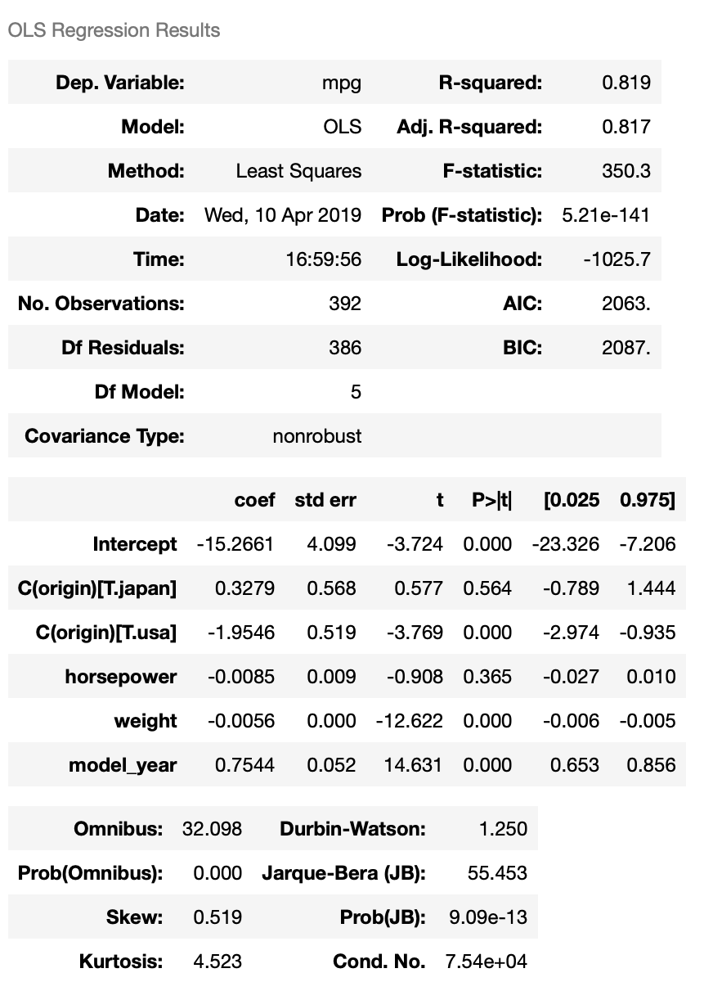

In this lesson, we will introduce one of the very basic modeling technique, **linear regression**, which constructs a simple model, such as

y = &beta;0 + &beta;1 x1 + &beta;2 x2 + ... + &beta;n xn

from a data set. This model builds on assumptions, such as the features are linearly independent and any errors in the regression are normally distributed, to build a model from the independent variables (i.e., x1..xn) for the dependent variable (y). In some application areas, the independent variables are known as the predictors, while the dependent variable is known as the response variable. If only one feature is used (x), the technique is known as simple linear regression, while if more than one feature is used (x1, x2, ..., xn), the technique is known as multiple linear regression.

There are various implementations of regression in Python. In this lesson we will use python module `statsmodels` to construct a regression model on the mpg dataset, which can be loaded with seaborn `load_dataset()` function. We'd like to build a regression model to predict an automobile's fuel efficiency(mpg or mile per gallon) with multiple vehicle features.

First we will load the data and clean up the data.

### Load data
> ~~~
import seaborn as sns
mpg = sns.load_dataset("mpg")
# Display first few rows
mpg.head(5)
> ~~~
> {: .language-python}
{:height="150px"}

> ~~~
mpg.info()
> ~~~
> {: .language-python}
> ~~~
><class 'pandas.core.frame.DataFrame'>
>RangeIndex: 398 entries, 0 to 397
>Data columns (total 9 columns):
>mpg             398 non-null float64
>cylinders       398 non-null int64
>displacement    398 non-null float64
>horsepower      392 non-null float64
>weight          398 non-null int64
>acceleration    398 non-null float64
>model_year      398 non-null int64
>origin          398 non-null object
>name            398 non-null object
>dtypes: float64(4), int64(3), object(2)
>memory usage: 28.1+ KB
> ~~~
> {: .output}

This dataset has 9 columns. The column names are self-explanatory. There are 398 rows in the dataset, and one column, horsepower, has 6 missing values. We will focus on linear regression in this lesson so we will simply drop the rows with missing value to get a clean dataset. This is by no means the best approach since we will lose valuable data points. An alternative is estimating horsepower by other factors, ie. displacement and acceleration.
> ~~~
#simply drop missing values
mpg.dropna(inplace=True)
mpg.info()
> ~~~
> {: .language-python}
> ~~~
><class 'pandas.core.frame.DataFrame'>
>Int64Index: 392 entries, 0 to 397
>Data columns (total 9 columns):
>mpg             392 non-null float64
>cylinders       392 non-null int64
>displacement    392 non-null float64
>horsepower      392 non-null float64
>weight          392 non-null int64
>acceleration    392 non-null float64
>model_year      392 non-null int64
>origin          392 non-null object
>name            392 non-null object
>dtypes: float64(4), int64(3), object(2)
>memory usage: 30.6+ KB
> ~~~
> {: .output}

### Descriptive Statistics

Our next step is to compute basic descriptive statistics for the features in this data set. To accomplish this, we can use the `describe()` function on our Pandas DataFrame.
> ~~~
mpg.describe()
> ~~~
> {: .language-python}
{:height="250px"}

### Regression Model

Now we've loaded the dataset and cleaned it up. We also have some basic understandings of the dataset. Since we want to build a model to predict fuel efficiency, the depend variable will be mpg. The next step is to pick dependent variables. All of the rest 8 columns can be independent variables. There are two types of variables in the dataset, **categorical** and **continuous**.

- Categorical Variables: the value is limited and usually based on a particular finite group. For example, origin
- Continuous Variables: numeric variables that have an infinite number of values between any two values. For example, horsepower

In a regression model, dependent variable must be continuous variable. Independent variables can be continuous or categorical. But when we pick categorical variables as independent variables, we normally need to create dummy variables for them. Take origin in this dataset as an example, as shown below, origin has three unique values, usa, japan and europe.

> ~~~
mpg.origin.unique()
> ~~~
> {: .language-python}
> ~~~
> array(['usa', 'japan', 'europe'], dtype=object)
> ~~~
> {: .output}

To create dummy variables for origin, we can add two new columns to the dataset, say origin_usa and origin_japan.

- If origin = usa, orign_usa = 1 and origin_japan = 0;
- If origin = japan, origin_usa=0 and origin_japan = 1;
- If origin = europe, orgin_usa=0 and origin_japan = 0.

As shown above, even though there are three distinct values, we only need 2 dummy columns to cover all the cases.

The python module `statsmodels` provides a way to create dummy variables for categorical variables, so we don't have to do it manually.

For this regression, mpg will be dependent variable, we will pick horsepower, weight and origin as independent variables. Among them, origin is categorical variable and the other two are continuous variables. The process to select independent variables can be very complicated and it's out of the scope of this lesson.

To construct the regression model, we first need to define a string-formula using column names(column names can't have whitespaces). For this dataset and variables we choose, the formula is defined as:

`mpg ~ horsepower + weight + C(origin)`

In this formula, mpg is dependent variable, horsepower, weight and origin are independent variable. `C(origin)` indicates that origin is categorical variable.

We will then construct the model with the string formula and the dataset, then fit the model and display the summary of the regression result.

> ~~~
import statsmodels.formula.api as smf
formula = 'mpg ~ horsepower + weight + C(origin)'
model = smf.ols(formula, data=mpg)
result = model.fit()
result.summary()
> ~~~
> {: .language-python}
{:height="650px"}

### Interpret Regression Result

First we have the dependent variable and the model and the method. OLS stands for [Ordinary Least Squares](http://setosa.io/ev/ordinary-least-squares-regression/) and the method “Least Squares” means that we’re trying to fit a regression line that would minimize the square of distance from the regression line.

The model has R-Squared value 0.719, means 71.9% of the variance in our dependent variable(mpg) can be explained by this model.

Based on the coefficient values, we can construct the regression equation:

mpg = 43.7 - 0.0535 horsepower - 0.0048 weight + 1.7811 origin.japan - 0.9611 origin.usa

This reads:

1. Horsepower increase by 1, mpg will decrease by 0.0535
2. Weight increase by 1 pound, mgp will decrease by 0.0048
3. If origin is Japan, mpg will increase by 1.7811(comparing to European cars)
4. If origin is USA, mpg will decrease by 0.9611(comparing to European cars)

For an European car, origin.japan=0 and origin.usa=0, so the equation becomes:

mpg = 43.7 - 0.0535 horsepower - 0.0048 weight

Which means the impact of origin in incorporated in the intercept. That's why the impact of origin.japan and origin.usa is on top of European cars.

So far so good, we've got a model that can predict auto mpg with horsepower, weight and origin to certain extend(R2=0.719). But we need to look into the coefficient table further, especially **t scores** and **p values**(p>\|t\|), for hypothesis test. \|t\|>2 or P < 0.05 indicates the coefficient is statistically significant(at 95% confidence). The coefficient of origin.usa has a p value 0.134, which means it's not statistically significant, or we can't reject the null-hypothesis that the coefficient is 0(at 95% confidence). This is also indicated by the 95% confidence interval of the coefficient, -2.220 to 0.298, which covers 0. Based on the p-value, we can say that Japanese cars are more efficient than European cars holding horsepower and weight constant, but we can't say the same thing for American cars at 95% confidence level.

### model_year, Categorical or Continuous?

Fuel efficiency improves over time. So it make sense to add model_year to the regression model as independent variable. model_year column contains numeric values, we can add it as a continuous variable. The formula then looks like this:

`mpg ~ horsepower + weight + C(origin) + model_year`

However, this model assumes that fuel efficiency changes linearly over time, which is obviously not true. So it's better add model_year into the regression model as a categorical feature, which leads to following formula:

`mpg ~ horsepower + weight + C(origin) + C(model_year)`

We will compare these two models in following code cells.

> ~~~
formula = 'mpg ~ horsepower + weight + C(origin) + model_year'
model = smf.ols(formula, data=mpg)
result = model.fit()
result.summary()
> ~~~
> {: .language-python}
{:height="550px"}

We can see that adding model_year to the model increase 𝑅2 from 0.719 to 0.819. The coefficient of model_year is 0.7544, which means mpg increases by 0.7544 each year. The coefficient is also statistically significant. Now let's see what we get when we add model_year to the regression model as a categorical variable.

> ~~~
formula = 'mpg ~ horsepower + weight + C(origin) + C(model_year)'
model = smf.ols(formula, data=mpg)
result = model.fit()
result.summary()
> ~~~
> {: .language-python}
{:height="850px"}

The new model has R2=0.852. And if we look into the coefficients of dummy variables of model_year, we can see that from 1971 to 1976, there's not much improvement in vehicle mpg; from 1977 to 1982, vehicle mpg has significant improvements every year. This model gives better R2 and reveals more insight in vehicle mpg changes over time. One drawback of this model is that we can't predict vehicle mpg with it if the vehicle is made after 1982. But overall, we can see that adding model_year as categorical variable gives us a better regression model.

Notice that when we add model_year to the regression model, the coefficient of horsepower is no longer significant. This indicates that there could be a [multicollinearity](https://en.wikipedia.org/wiki/Multicollinearity) problem, or horsepower could somewhat be explained by other independent variables. This is a very important concept in linear regression but it's out of the scope of this lesson.

> ## Challenge
>
> Drop horsepower from the regression model, only include weight, origin and model_year. What's the impact of this change?
>
{: .challenge}
